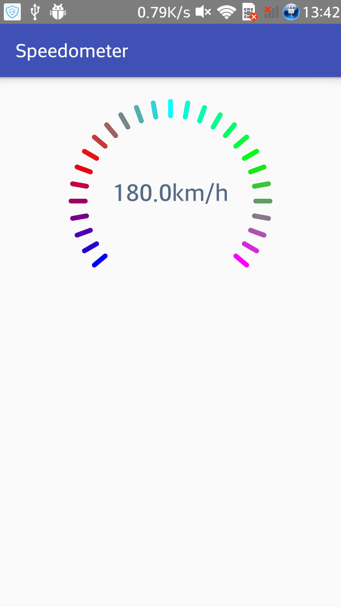

# Speedometer

在layout文件中进行如下配置：

     <com.lgm.speedometerlib.Speedometer
            android:id="@+id/speedometer_view"
            android:layout_width="230dp"
            android:layout_height="230dp"
            android:layout_centerHorizontal="true"
            android:background="#00000000"
            app:currentSpeed="180"
            app:maxSpeed="180"/>
            
如需阶段性修改刻度颜色：

    speedometer.addColor(Color.BLUE);
    speedometer.addColor(Color.RED);
    speedometer.addColor(Color.CYAN);
    speedometer.addColor(Color.GREEN);
    speedometer.addColor(Color.MAGENTA);
    
使用上面代码可以得到预览图中的效果。
            